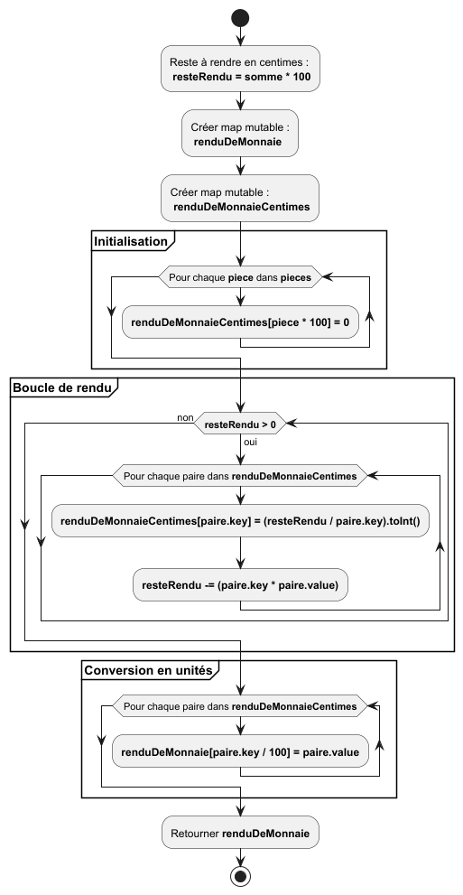
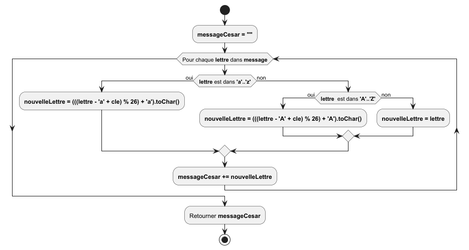

# SUJET 04 : Problèmes divers

## Présentation générale :
Des problèmes permettant de vous entrainer.

## Sujet 04-a : Dictionnaire (map) d'occurrences

### Présentation de l'algorithme :
La fonction prend une liste contenant des entiers et retourne un dictionnaire ou chaque valeur de la liste sera représentée par une clé du dictionnaire. Chaque valeur associée aux clés correspond au nombre d'occurrences de la clé dans la liste.

### Travail à réaliser :

Compléter la fonction `mapDesOccurrences(liste: List<Int>): Map<Int, Int>`.

### EXEMPLE 1 :
* Liste donnée : [1, 3, 1, 5, 1, 5, 2]
* Résultat : [1 to 3, 3 to 1, 5 to 2, 2 to 1]

### EXEMPLE 2 :
* Liste donnée : [6, 1, 1, 5, 4]
* Résultat : [6 to 1, 1 to 2, 5 to 1, 4 to 1]

## Sujet 04-b : Algorithme Glouton

### Présentation de l'algorithme :
Un algorithme dit glouton correspond à une stratégie permettant de trouver une solution à un problème proche ou égal à la solution optimale. Ce type de stratégie s'applique donc à des problèmes qui peuvent comporter plusieurs solutions.
Le problème du rendu de monnaie est un classique. Tout automate (machines à boissons, distributeur diverses, etc.) doivent rendre la monnaie du somme au client. Ces machines comportent généralement une stratégie gloutonne pour choisir les pièces à donner (parmi les pièces disponibles) et dont la somme correspond à la somme à rendre.

Quelques liens illustrant le problème du rendu de monnaie :
* https://fr.wikipedia.org/wiki/Problème_du_rendu_de_monnaie

### Travail à réaliser :

Compléter la fonction `algoGloutonRenduMonnaie(somme: Double, pieces: List<Double>): Map<Double, Int>`. 

#### Solution sous forme de diagramme d'activité :
Afin de vous aider, nous vous fournissons la solution sous forme de diagramme d'activités :

### EXEMPLE 1 :
* Somme à rendre : 13.28
* Pièces disponibles : [2.0, 1.0, 0.5, 0.2, 0.1, 0.05, 0.02, 0.01]
* Rendu proposé : [2.0 to 6, 1.0 to 1, 0.5 to 0, 0.2 to 1, 0.1 to 0, 0.05 to 1, 0.02 to 1, 0.01 to 1]

### EXEMPLE 2 :
* Somme à rendre :7.88
* Pièces disponibles : [2.0, 1.0, 0.5, 0.2, 0.1, 0.05, 0.02, 0.01]
* Rendu proposé : [2.0 to 3, 1.0 to 1, 0.5 to 1, 0.2 to 1, 0.1 to 1, 0.05 to 1, 0.02 to 1, 0.01 to 1]

## Sujet 04-c : Chiffre de César

### Présentation de l'algorithme :

Le chiffre de César est un algorithme de chiffrement d'un message qui consiste tout simplement à procéder à un décalage constant pour tous les caractères du message à chiffrer.

* https://fr.wikipedia.org/wiki/Chiffrement_par_décalage

#### Représentation de la solution sous forme de diagramme d'activité :

### Travail à réaliser :

Compléter la fonction `chiffrerCesar(cle: Int, message: String): String`. Elle prend en 1er argument un entier représentant le décalage (la clé de chiffrement). La fonction prend en 2e argument le message à chiffrer. Elle retourne le message sous forme chiffrée.

### EXEMPLE 1 :
* Clé : 3
* Message orignal : "Hello World !"
* Message chiffré : "Khoor Zruog !"

### EXEMPLE 2 :
* Clé : 1
* Message orignal : "We are the Champion !"
* Message chiffré : "Xf bsf uif Dibnqjpo !"

## Sujet 04-d : Identifier un palindrome

### Présentation de l'algorithme :

Un palindrome est une chaîne de caractères qui possède une propriété de symétrie. Autrement dit, nous retrouvons la même phrase/mot en inversant la chaîne de caractères.

Exemples de palindromes :
* non
* radar

### Travail à réaliser :

Compléter la fonction `estPalindrome(texte: String): Boolean`. Elle prend en 1er argument un String. Elle retournera True si la chaîne est un palindrome.

### EXEMPLE 1 :
* Chaîne : "non"
* Résultat : true

### EXEMPLE 2 :
* Chaîne : "coucou"
* Résultat : false

### EXEMPLE 3 :
* Chaîne : "oui"
* Résultat : false
* 
### EXEMPLE 4 :
* Chaîne : "radar"
* Résultat : true

### EXEMPLE 5 :
* Chaîne : "tenet"
* Résultat : true

## Sujet 04-e : Trouver un gène

### Présentation de l'algorithme :

Votre algorithme devra retrouver un gène dans une séquence d'**ADN**. Les séquences d'**ADN** sont codées à partir de 4 base nucléiques auxquels on fait correspondre 4 lettres : **A**, **G**, **C** et **T**

Nous représenterons toute séquence d'**ADN** par une chaîne de caractères comportant les lettres **AGCT**.

Un gène est une portion d'**ADN** comportant une séquence donnée des lettre **A**, **G**, **C** et **T**.

A voir : https://fr.wikipedia.org/wiki/Code_génétique

#### Représentation de l'algorithme sous forme de diagramme d'activité :

### Travail à réaliser :

Compléter la fonction `trouverGene(gene: String, seqADN: String): Boolean`. Elle prend en 1er argument un String correspondant au gène cherché et en second argument un String représentant la séquence d'ADN. Elle retournera True si le gène est présent dans la séquence d'ADN.

### EXEMPLE 1 :
* Gène : "AATC"
* Séquence ADN : "GTACAAATCTTGCC"
* Résultat : true

### EXEMPLE 2 :
* Gène : "AGTC"
* Séquence ADN : "GTACAAATCTTGCC"
* Résultat : false

### EXEMPLE 3 :
* Gène : "GCC"
* Séquence ADN : "GTACAAATCTTGCC"
* Résultat : true

### EXEMPLE 3 :
* Gène : "GTA"
* Séquence ADN : "GTACAAATCTTGCC"
* Résultat : true
